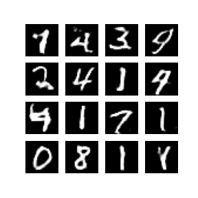
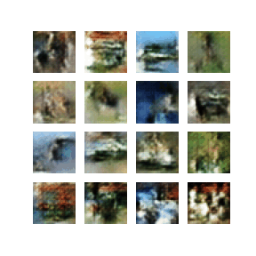

# DCGANs

Implementing a  **DCGAN** on MNIST digits data and CIFAR-10 data using Tensorflow.

Generally **DCGANs** contains two networks, a **Generator** and a **Discriminator**. So as name says generator keeps on generating images by taking in some noise and discriminator distinguishes between original images and generated images.

### Generator

Generator takes in some noise as input and we need to follow the following rules which are experimental observations as mentioned in [paper][2] for good results:

* We need to use **Fractional strided convolution**(*or Transposed convolution*) to upsample so that it can learn its own upsampling.
* We need to use **ReLU** activation in all layers except in last layer where we use **tanh** activation.
* We need to use **Batch Normalization** in all layers except output and we need not use dense layers on top of conv layers as we need to return an image.

### Discriminator

Discriminator takes in images as input and we need to follow following rules which are experimental observations as mentioned in [paper][2] for good results:

* We need to use **strided convolution** instead of max-pooling layers to downsample so that it can learn its own downsampling.
* We need to use **LeakyReLU** activation with a leak of *0.2-0.3* in all layers except in last layer where we use **sigmoid** activation as this is used for binary classification task.
* We need to **Batch Normalization** in all layers except output and we need not use dense layers but in the output layer we just use one unit as output (*real* or *fake*)

## Results

    

        

    <small><i>GIFs created using generated images by generator.</i></small>

The one on the left was trained for *100 epochs* which took around *an hour* and the one on the right was trained for *40 epochs* which took around *one and half hour*.  

## References

* [Ian Goodfellow et al., Generative Adversarial Networks][1]

* [Alec Radford et al., Unsupervised Representation Learning with Deep Convolutional Generative Adversarial Networks][2]

[1]:https://arxiv.org/abs/1406.2661
[2]:https://arxiv.org/abs/1511.06434

<smal>&copy <a href="https://github.com/vstark21">V I S H W A S</a></small>

